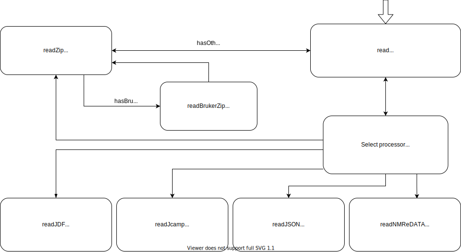

# nmr-load-save

<p align="center">
  Package to load and save NMR spectra.
</p>
<p align="center">
  
</p>

## Installation

`$ npm i nmr-load-save`

## Usage

```js
import { fileCollectionFromPath } from 'filelist-utils';
import { read, writeNmredata } from 'nmr-load-save';

const fileCollection = fileCollectionFromPath('path_to_data');
// we can read a zip, jdx, jdf, nmredata, json, nmrium file extensions
const result = await read(fileCollection, options);

// based on extension we choose the format processor
console.log(result);
// return {
//   spectra: [],
//   molecules: [],
// }
```

## License

[MIT](./LICENSE)

[npm-image]: https://img.shields.io/npm/v/nmr-load-save.svg
[npm-url]: https://www.npmjs.com/package/nmr-load-save
[ci-image]: https://github.com/cheminfo/nmr-load-save/workflows/Node.js%20CI/badge.svg?branch=main
[ci-url]: https://github.com/cheminfo/nmr-load-save/actions?query=workflow%3A%22Node.js+CI%22
[codecov-image]: https://img.shields.io/codecov/c/github/cheminfo/nmr-load-save.svg
[codecov-url]: https://codecov.io/gh/cheminfo/nmr-load-save
[download-image]: https://img.shields.io/npm/dm/nmr-load-save.svg
[download-url]: https://www.npmjs.com/package/nmr-load-save
